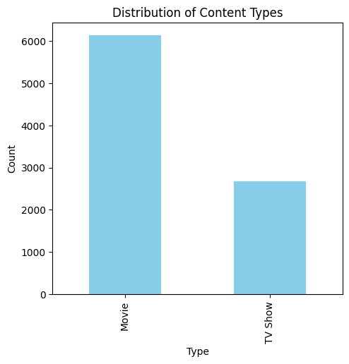
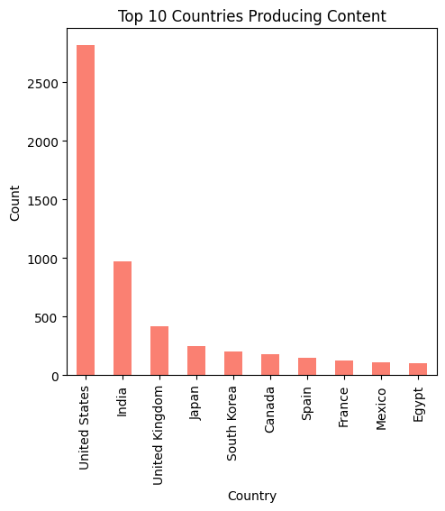
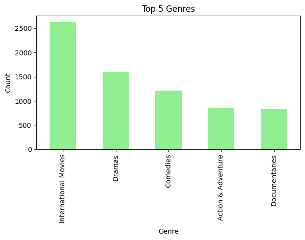
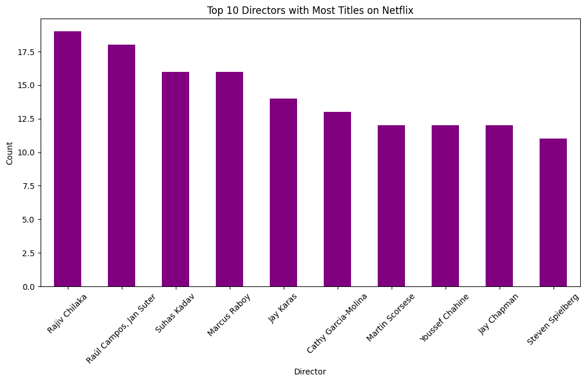

# Netflix-Project
<!-- About The Project -->

<!-- TABLE OF CONTENTS -->

Table of Contents

<ol>
  <li><a href="#description">Description</a></li>
  <li><a href="#dataset">Dataset</a></li>
     <li><a href="#exploratory-data-analysis">Exploratory Data Analysis</a></li>
    <ul>
      <li><a href="#visualize-distribution-of-content-types">Visualize Distribution of Content Types</a></li>
      <li><a href="#visualize-country-distribution">Visualize Country Distribution</a></li>
      <li><a href="visualize -distribution-of-genre">Visualize  Distribution of genre</a></li>  
      <li><a href="visualize-director-distribution">Visualize Director Distribution</a></li>     
    </ul>
  </li>
  </li>
</ol>

# Author: Lilian Ngonadi

# Description

- This project aims to analyze Netflix content distribution and the sentiment of descriptions. It identifies trends in content types, countries producing content, and genres, and categorizes sentiment into positive, negative, and neutral.
- Additionally, the project groups titles based on release year and duration using clustering techniques. The analysis provides insights for content strategy and viewer engagement.

# Dataset

The dataset [Netflix  Titles dataset](https://www.kaggle.com/datasets/shivamb/netflix-shows?resource=download&select=netflix_titles.csv) is a comprehensive collection of information on various movies and TV shows available on Netflix. The dataset includes details such as the title, type, release year, duration, country, rating, and description, among other attributes:

- **show_id** :  Unique identifier for each title.
- **type** : Type of content (e.g., Movie, TV Show).
- **title** : Title of the content.
- **director** : Director(s) of the content.
- **cast** : Cast members in the content.
- **country**: Country where the content was produced.
- **date_added** : Date when the content was added to Netflix.
- **release_year** : Year the content was released.
- **rating** :Content rating (e.g., PG, R).
- **duration** :Duration of the content (e.g., 90 min, 1 Season).
- **listed_in** :Genres the content is listed under.
- **description** :Description of the content.

# Exploratory Data Analysis
* To analyze the distribution and trends of content types, countries producing content, and genres on Netflix using the [Netflix  Titles dataset](https://www.kaggle.com/datasets/shivamb/netflix-shows?resource=download&select=netflix_titles.csv)
## Visualize Distribution of Content Types
- The chart indicates that there are significantly more movies available on Netflix compared to TV shows. The count of movies exceeds 6000, while the count of TV shows is slightly above 3000.
- There are roughly twice as many movies as TV shows, suggesting that Netflix's catalog leans heavily towards movie content.

## Visualize Country Distribution

The bar chart shows that the United States is the dominant producer of Netflix content, contributing over 2500 titles. India follows as the second-largest contributor, with the United Kingdom in third place. Other notable contributors include Japan, South Korea, Canada, Spain, France, Mexico, and Egypt. This diverse range of content sources reflects Netflix's global reach and its strategy to cater to a wide variety of audience preferences worldwide.

## Visualize  Distribution of genre

The  chart shows that the most prevalent genre on Netflix is International Movies, with over 2500 titles. This is followed by Dramas with around 1500 titles, and Comedies with about 1000 titles. Action & Adventure and Documentaries each have approximately 800 titles. This indicates a diverse content library on Netflix, with a strong emphasis on international movies and a balanced mix of other popular genres.

## Visualize Director Distribution

This chart highlights the directors who have a substantial number of works featured on Netflix, showcasing their prolific contributions to the platform's diverse range of content.

